# AlphaTrack

*[🇩🇪 Deutsche Version](README.de.md)*

**Local trading journal + bot analyzer - runs on your PC or NAS, no cloud account needed.**

Log every trade, connect your MT5 bot via the bridge, and analyze your performance with AI support.

---

[](https://github.com/G99SEMAN/AlphaTrack/releases)
[](https://github.com/G99SEMAN/AlphaTrack/stargazers)
[](https://nextjs.org/)
[](https://www.typescriptlang.org/)
[](https://www.docker.com/)
[](LICENSE)

---

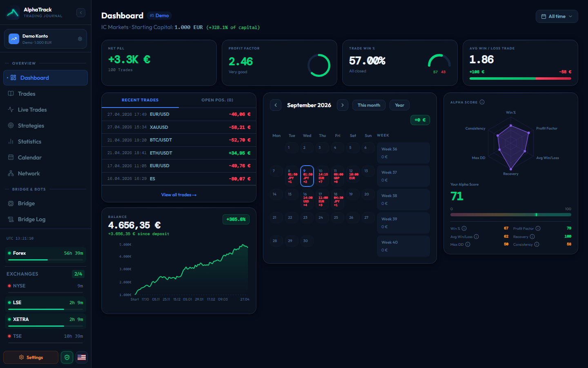

---

## Why I Built This

I trade through MetaTrader 5 and wanted a journal that keeps every trade, screenshot, and note on my own hardware — not in someone else's cloud behind a monthly subscription. The tools I found were either SaaS-only, disconnected from my own bots, or both. AlphaTrack is my answer: a local-first journal that runs on a NAS or any PC, talks directly to MT5 through a small bridge, and only calls out to an AI when I explicitly ask it to.

---

## Table of Contents

- [Why I Built This](#why-i-built-this)
- [Features](#features)
- [Navigation](#navigation)
- [Languages](#languages)
- [Screenshots](#screenshots)
- [Installation](#installation)
  - [Setup Wizard (recommended)](#setup-wizard-recommended)
  - [Manual Installation](#manual-installation)
  - [Docker / NAS Deployment](#docker--nas-deployment)
- [Getting Started](#getting-started)
- [Configuration](#configuration)
- [Project Structure](#project-structure)
- [Data Storage](#data-storage)
- [Backtesting](#backtesting)
- [Tech Stack](#tech-stack)
- [PWA / Mobile](#pwa--mobile)
- [Home Network Infrastructure](#home-network-infrastructure-recommendation)
- [Contributing](#contributing)
- [License](#license)
- [Disclaimer](#disclaimer)

---

## Features

### Trading Journal

| Feature | Description |
|---|---|
| **Dashboard** | PnL cards, win rate, risk/reward, equity curve, recent trades, warnings for long-running open positions |
| **Trading Journal** | Log trades in full detail: entry, exit, SL/TP, fees, strategy, tags, notes, and chart screenshots |
| **Statistics** | In-depth breakdowns by strategy and instrument, R-multiple distribution, weekday analysis, monthly PnL chart |
| **Strategies** | Create trading strategies, link them to trades, and automatically evaluate performance per strategy |
| **Economic Calendar** | Economic events for the next 2 weeks (via Tradays/MQL5), filterable by importance and currency |
| **AI Market Analysis** | Real-time candle analysis via the MT5 bot - bias, entry, SL/TP, and R/R recommendation powered by Claude AI |
| **AI Explanations** | Clicking an event in the economic calendar gives you an explanation (what's being measured, why it matters, impact on the currency). Requires `ANTHROPIC_API_KEY`, runs on Claude Haiku with a tight token budget, and is cached per event - keeping token usage minimal |
| **Multi-Profile** | Manage multiple accounts in parallel (live, demo), each with its own starting capital, broker, and currency |
| **Backup & Restore** | Full data backup as a ZIP bundle including screenshots; import to restore |
| **PWA-capable** | Installable as an app on your phone or tablet |
| **Local Data Storage** | All data stays local as JSON files - no cloud, no external dependencies |

### Bot Analyzer (Bridge)

| Feature | Description |
|---|---|
| **Bridge Dashboard** | Live status of all connected bots with connection indicators (MT5, Bridge, AlphaTrack) |
| **Live Trades** | The bot's open positions in real time, including a close function |
| **Trade Analyzer** | AI-powered market analysis based on real MT5 candles (M5 scalping / H1 intraday) |
| **Bridge Log** | Bridge logs filterable by level (INFO/WARN/ERR), with CSV/JSON export |
| **Bot Performance** | Bot statistics, equity curve, and performance metrics per bot |
| **Bot Settings** | Configure the bot, adjust parameters, control its state |
| **Trade Executor** | Execute trades directly in MT5 (symbol, direction, lots, SL/TP) |
| **Watchdog Panel** | Bridge status, restart function, and bot control (start/pause/stop) |
| **Network (Auto-Discovery)** | Automatically detect and register the bridge and bots on the local network |
| **TradingLockContext** | Safety kill switch in the sidebar - locks all trade buttons by default |

---

## Navigation

A single navigation, always visible - no mode switching.

**Trading Journal:** Dashboard - Trades - Statistics - Strategies - Calendar - Analysis - TPC

**Bot Analyzer:** Bridge (Analysis / Log / Trades) - Bots (Performance / Settings) - Network

**Kill switch:** Next to the logo in the sidebar - `ShieldCheck` (green = locked/safe) / `ShieldOff` (red = trading active). Default: locked.

**Color themes:** 3 selectable accent colors - Blue (default), Crimson (`#f43f5e`), Violet (`#a855f7`)

---

## Languages

The app is fully bilingual (German/English) - cookie-based switching in Settings, no URL routing. Exception: profile creation/editing (`src/app/setup/`, `src/components/profile/ProfileSetupForm.tsx`, `ProfileEditModal.tsx`, `ProfileSetupModal.tsx` - roughly 1284 lines) isn't translated yet and stays German on purpose until a dedicated sub-plan covers it.

---

## Screenshots

| Dashboard | Trading Journal | Bridge Overview |
|---|---|---|
| 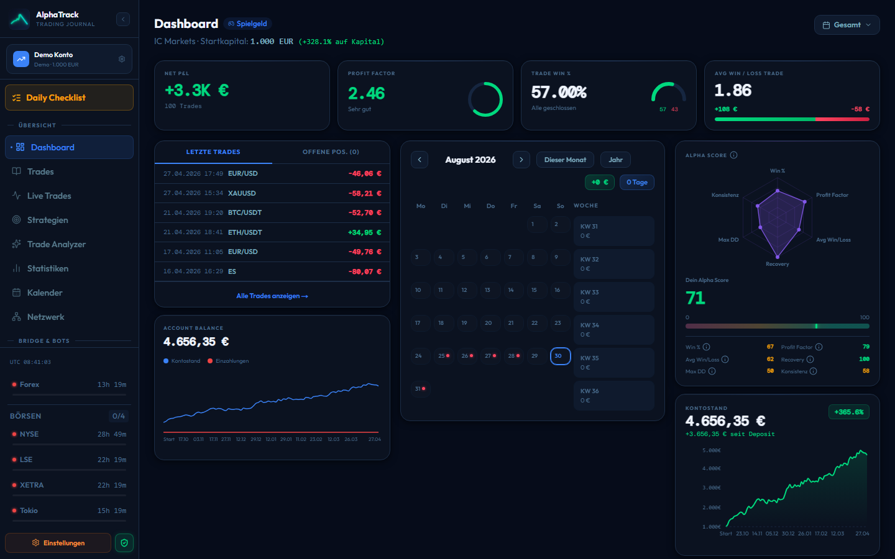 | 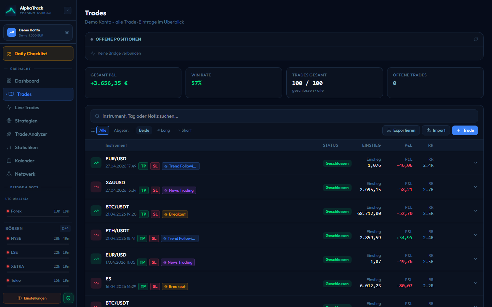 | 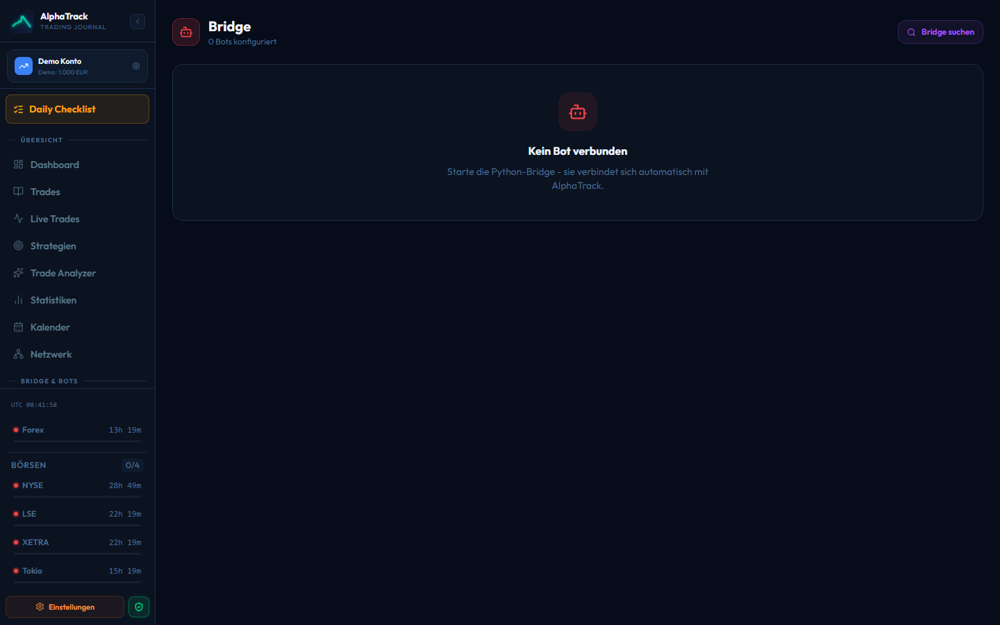 |

| Statistics | Calendar | Strategies |
|---|---|---|
| 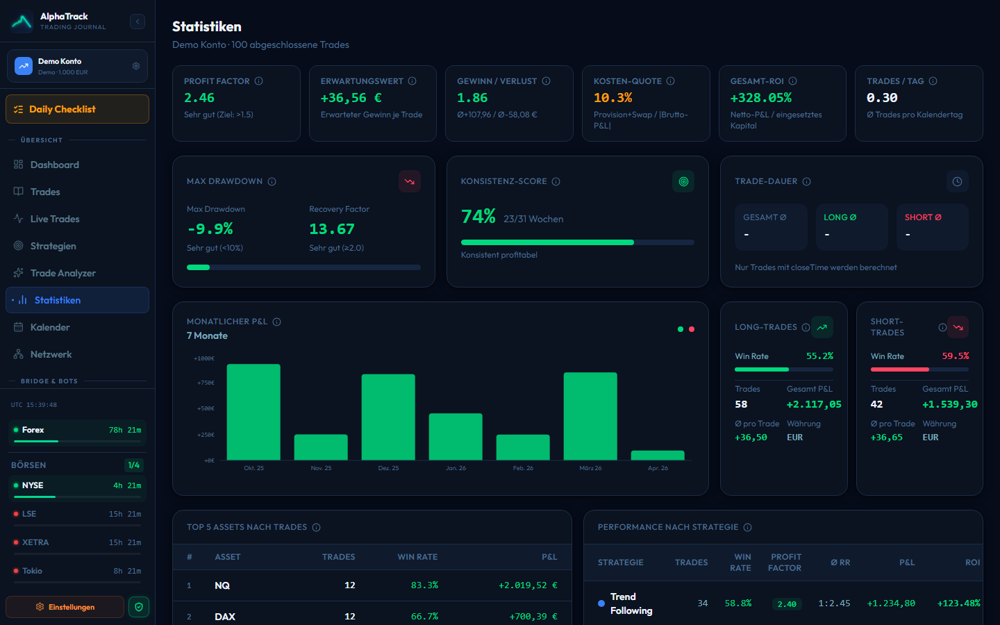 | 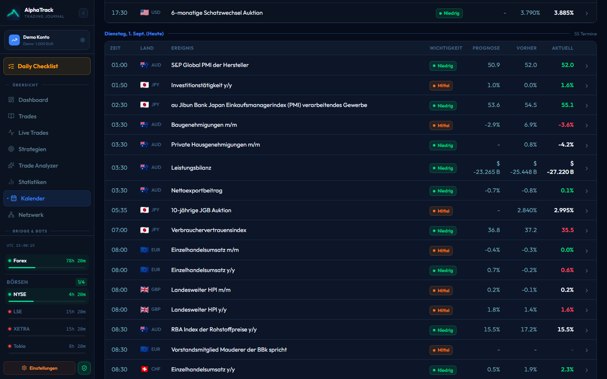 | 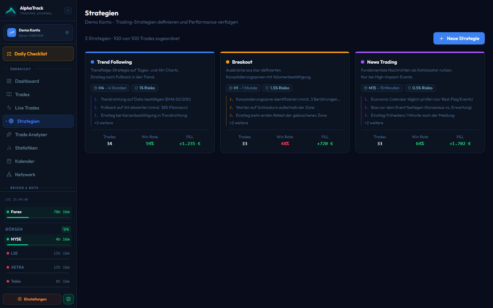 |

| Bot Performance | Network | Day Details |
|---|---|---|
| 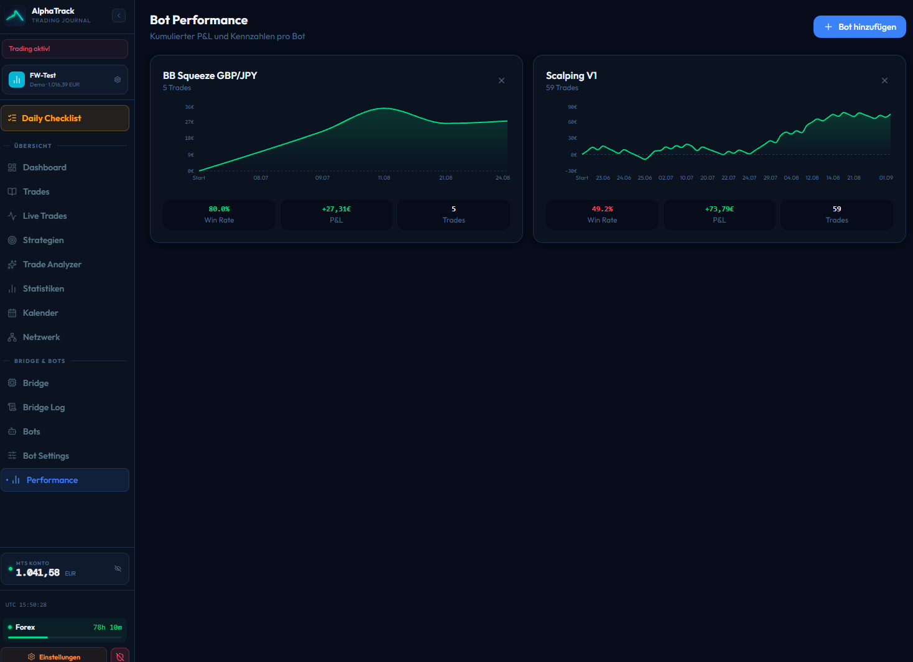 | 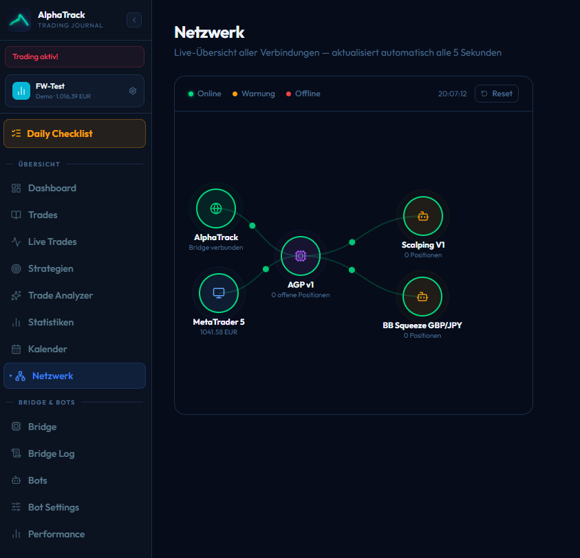 | 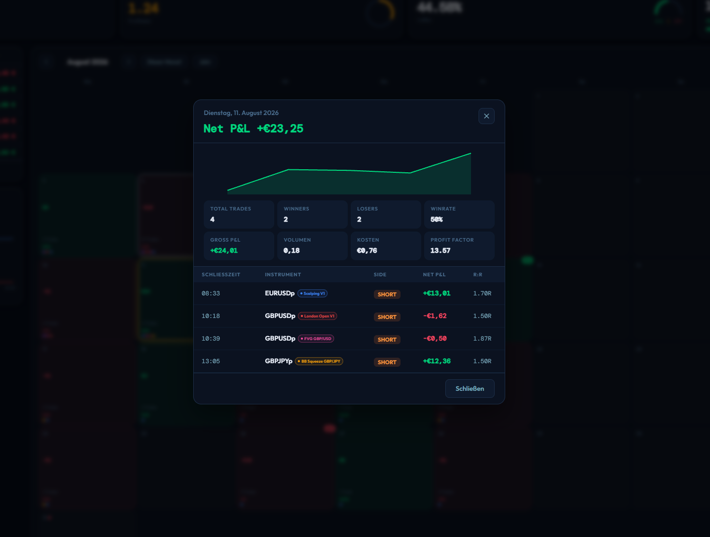 |

| Economic Calendar: AI Explanation |
|---|
| 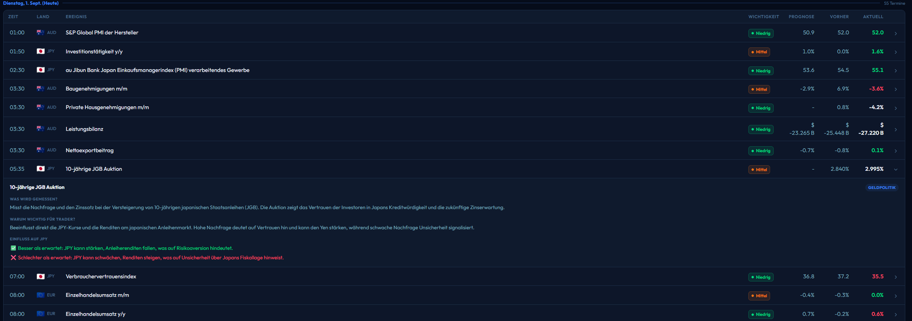 |

---

## Installation

Three ways to get AlphaTrack running — the setup wizard is the fastest and is recommended.

### Setup Wizard (recommended)

> **Windows only** — the wizard is a PowerShell script. On macOS/Linux, go straight to the [manual installation](#manual-installation).

```bash
git clone https://github.com/G99SEMAN/AlphaTrack.git
cd AlphaTrack
setup.bat
```

`setup.bat` launches an interactive wizard that walks you through the entire setup:

1. **Choose language** (German/English)
2. **Choose usage mode** — trading journal only, or journal + automated bots
3. **Check prerequisites** — Git, Node.js 18+, and for bot usage also Python 3.10+ (missing packages are installed automatically via `winget`)
4. **Create configuration** — `.env.local` (including a randomly generated `BOT_API_KEY`), and for bot usage also `bridge/config.json` with your MT5 credentials
5. **Install dependencies** — `npm install`, and for bot usage also `pip install -r bridge/requirements.txt`
6. **Start the app** — automatically opens `http://localhost:3000` in your browser

For a distributed setup (dashboard on a NAS/server, MetaTrader + bots on a separate PC), the wizard also walks you through SSH key setup and deployment — run `setup.bat` once on each of the two machines for that.

### Manual Installation

**Requirements:** [Node.js](https://nodejs.org/) >= 18

```bash
# 1. Clone the repository
git clone https://github.com/G99SEMAN/AlphaTrack.git
cd AlphaTrack

# 2. Install dependencies
npm install

# 3. Set up environment variables
cp .env.example .env.local
# fill in your keys in .env.local

# 4. Start the dev server
npm run dev
```

App runs at: **http://localhost:3000**

> On the very first request to a page, Next.js compiles the route in the background — this can take 20-40 seconds on first load. Not an error, it's fast after that.

### Docker / NAS Deployment

AlphaTrack runs as a Docker container - tested on **Synology NAS**.

#### Start

```bash
docker compose up -d
```

App reachable at: **http://\<NAS-IP\>:3002**

#### docker-compose.yml

```yaml
version: '3.8'
services:
  alphatrack:
    build: .
    container_name: alphatrack
    restart: unless-stopped
    ports:
      - "3002:3000"
    env_file:
      - .env.local
    volumes:
      - ./data:/app/data
```

> The `data/` volume persists all trades, profiles, bot data, and cached AI explanations outside the container.

#### Deploy (NAS + trading PC)

`scripts\windows\deploy.bat` starts the interactive deploy:

1. **Configuration prompt** — NAS access, trading PC access, MT5 login credentials.
   Answers are saved to `scripts/windows/deploy.config.json` (gitignored);
   pressing Enter reuses the saved value on the next run.
2. **NAS** — git push, ensures `.env.local` has `BOT_API_KEY`, container rebuild,
   selecting the trading profile from the NAS.
3. **Trading PC** — copies `bridge/` + `bots/` via SSH, generates configs,
   firewall rule (TCP 8765), and a scheduled task "AlphaTrack Bridge" (start on
   login). Bots are only copied — start manually via `start.bat`.
4. **Check** — waits until the bridge has registered with the NAS's AlphaTrack.

**One-time on the trading PC:** enable the OpenSSH server (Settings → Optional
Features → "OpenSSH Server", then `Set-Service sshd -StartupType Automatic` +
`Start-Service sshd` as admin). The SSH user needs admin rights
(firewall/task scheduler). MetaTrader 5 and Python must be installed.

##### Set up an SSH key (no password on deploy)

```
powershell -NoProfile -ExecutionPolicy Bypass -File scripts\windows\setup-ssh-key.ps1
```

The script generates an ed25519 key pair under `%USERPROFILE%\.ssh\alphatrack_deploy`
and prints the public key with copy commands for the trading PC.
Since Windows OpenSSH doesn't allow empty passwords, the public key must be entered
**once, manually**, on the trading PC (physically or via Remote Desktop):

```powershell
# Run on the trading PC:
Add-Content "$env:USERPROFILE\.ssh\authorized_keys" "ssh-ed25519 AAAA... (paste public key)"
icacls "$env:USERPROFILE\.ssh\authorized_keys" /inheritance:r /grant:r "${env:USERNAME}:F"
```

On the next `deploy.bat` run, enter the displayed key path at **"Trading PC SSH key path"** —
after that the deploy runs passwordlessly.

---

## Getting Started

Once AlphaTrack is running, here's the fastest way to see it in action:

1. **Open the app** — `http://localhost:3000` (or your NAS address) and create your first profile (broker, starting capital, currency)
2. **Log a trade** — either by hand in the [Journal](#features) (entry, exit, SL/TP, notes, screenshot), or import an MT5 account history via the built-in HTML importer
3. **Connect a bot** *(optional)* — start the [bridge](#installation) on your trading PC; every MT5 trade, manual or bot-driven, syncs into the journal automatically from that point on
4. **Check the Dashboard** — PnL, win rate, equity curve, and the trading calendar update live as trades come in

That's it — no further configuration is required to start journaling.

---

## Configuration

Create a `.env.local` in the project root:

```env
# Anthropic API - for AI market analysis and economic calendar explanations
ANTHROPIC_API_KEY=sk-ant-...

# Twelve Data API - for price data in the analysis
TWELVE_DATA_API_KEY=...

# Bot authentication - must match the Python bridge
BOT_API_KEY=<your-api-key>

# Only if bridge auto-discovery doesn't work (a subnet other than 192.168.178.x)
LAN_SUBNET_PREFIX=192.168.1
```

| Variable | Required | Purpose |
|---|---|---|
| `ANTHROPIC_API_KEY` | Optional | AI market analysis, economic calendar explanations |
| `TWELVE_DATA_API_KEY` | Optional | Price data |
| `BOT_API_KEY` | Only with the bridge | Authenticates the Python bridge against AlphaTrack |
| `LAN_SUBNET_PREFIX` | Optional | Subnet prefix for bridge auto-discovery inside the Docker container (default: `192.168.178`) |

> API keys imported on the NAS are persisted to `data/api-keys.json` and survive container rebuilds.

---

## Project Structure

```
AlphaTrack/
+-- src/
|   +-- app/                      # Next.js App Router - pages
|   |   +-- dashboard/            # Dashboard with PnL, equity curve
|   |   +-- journal/              # Trading journal
|   |   +-- statistiken/          # Performance breakdown
|   |   +-- strategien/           # Strategy management
|   |   +-- kalender/             # Economic calendar
|   |   +-- analyse/              # AI market analysis
|   |   +-- tpc/                  # Trading Performance Calendar
|   |   +-- netzwerk/             # Auto-discovery of bridge and bots
|   |   +-- einstellungen/        # App settings & backup
|   |   +-- bridge/               # Bot analyzer (analyse/, log/, trades/)
|   |   +-- bots/                 # Bot management ([id]/, performance/, settings/)
|   |   +-- setup/                # Initial setup / create profile
|   |   +-- api/                  # API routes (bot/*, analyse/*, kalender/*)
|   +-- components/               # Reusable UI components
|   |   +-- layout/               # Sidebar, BottomNav, MarketSessions
|   |   +-- dashboard/            # Dashboard cards and charts
|   |   +-- journal/              # Trade modal, trade list, import
|   |   +-- statistiken/          # Statistics panels and charts
|   |   +-- strategien/           # Strategy management
|   |   +-- bot/                  # Bot components (controls, watchdog, live feed)
|   |   +-- bridge/               # Bridge components (status, discovery)
|   |   +-- analyse/              # Analysis components
|   |   +-- profile/              # Profile switcher, profile modal
|   +-- context/                  # React contexts
|   |   +-- TradingLockContext.tsx # Kill switch (locked/unlocked)
|   |   +-- BotStatusContext.tsx  # Central bot status polling (5s)
|   +-- lib/                      # Data logic & helpers
|   |   +-- data.ts               # Trade CRUD + stats calculation
|   |   +-- bot-data.ts           # Bot/bridge data access (atomicWrite)
|   |   +-- profiles.ts           # Profile CRUD
|   |   +-- strategies.ts         # Strategy CRUD
|   |   +-- api-keys.ts           # API key management (env + data/ fallback)
|   |   +-- analyse-data.ts       # Analysis history
|   +-- types/                    # TypeScript type definitions
+-- bots/                         # Python bots (testbot2 active, scaffold as template)
|   +-- testbot2/                 # Active test bot
|   +-- scalpingv1/               # EMA crossover + RSI scalping bot (EURUSDp M5)
|   +-- scaffold/                 # Bot template for new bots
|   +-- backtest/                 # Generic backtest runner (runner.py)
+-- bridge/                       # Python bridge (gateway.py, main.py, trade_executor.py)
+-- scripts/
|   +-- docker-entrypoint.sh      # Docker startup script (creates data/)
|   +-- nas-update.sh             # NAS update via SSH
+-- data/                         # Local JSON data storage (tracked in git)
+-- Dockerfile
+-- docker-compose.yml
+-- package.json
```

---

## Data Storage

All data lives locally in the `data/` folder as JSON files. No server, no database, no account.

```
data/
+-- profiles.json                     # All created profiles
+-- active.json                       # ID of the active profile
+-- trades-[PROFILE-ID].json          # Trades per profile
+-- strategies-[PROFILE-ID].json      # Strategies per profile
+-- bots.json                         # Bot configurations
+-- bot-status-[BOT-ID].json          # Last bot status (heartbeat)
+-- bot-log-[BOT-ID].json             # Bridge log entries (max 5000)
+-- bot-commands-[BOT-ID].json        # Pending bot commands
+-- bot-events-[BOT-ID].json          # Bot events (trades, signals)
+-- bot-trades-[PROFILE-ID].json      # Trades synced from the bot
+-- performance-bots.json             # Aggregated bot performance data
+-- event-explanations.json           # AI explanations for economic events (cache)
+-- api-keys.json                     # API keys imported via the UI (persisted on the NAS)
+-- analyse-history.json              # Last 10 AI market analyses
```

> All writes use atomic writes (tmp file + rename) - no corrupted JSON under concurrent requests.

Trade screenshots are stored under `data/screenshots/`.

> The `data/` folder is intentionally tracked in git (multi-device sync without a separate database). The data included here is a demo profile with no real trades. **If you use AlphaTrack for your own real trades, keep your fork/copy private** — otherwise your trading data becomes publicly visible on every `git push`.

### Backup & Restore

Settings lets you export a full backup as a `.zip` (including screenshots) and import it again on another device.

---

## Backtesting

Bots can be backtested against real MetaTrader data — with no live-trading risk. The data comes exclusively from MT5 via the bridge; no external data feed is needed.

### Requirements

- **Bridge is running** on the trading PC (MT5 connected, port 8765 reachable)
- **Python** + `requests` installed on the machine running the backtest
- The bot has a valid `config.json` with `bridge_url` and `api_key`

### Running a backtest

```bash
# From the AlphaTrack project directory:
python bots/backtest/runner.py --bot scalpingv1 --from 2026-01-01 --to 2026-06-14

# With an explicit bridge URL (if different from config.json):
python bots/backtest/runner.py --bot scalpingv1 --from 2026-01-01 --to 2026-06-14 --bridge http://<TRADING-PC-IP>:8765
```

**Parameters:**

| Parameter | Required | Description |
|---|---|---|
| `--bot` | Yes | Name of the bot folder under `bots/` (e.g. `scalpingv1`) |
| `--from` | Yes | Start date in `YYYY-MM-DD` format |
| `--to` | Yes | End date in `YYYY-MM-DD` format (inclusive) |
| `--bridge` | No | Bridge URL — default: the value from the bot's `config.json` |

### How it works

1. The runner reads `bots/<botname>/config.json` (symbol, timeframe, parameters)
2. Loads historical candles from the bridge endpoint `/historical_candles` (MT5 as the source)
3. Simulates the bot's `on_tick()` loop over the candles in a sliding window
4. SL/TP are checked against the high/low of each following candle
5. Any positions still open at the end are closed at the last close price

### Example Output

```
[Bridge] Lade Kerzen: EURUSDp M5 | 2026-01-01 → 2026-06-14 ...
[Bridge] 18432 Kerzen geladen
[Backtest] Warmup: 50 Kerzen | Test ab: 2026-01-01 09:05:00

==============================================================
  BACKTEST: Scalping V1
  Symbol   : EURUSDp | TF: M5
  Zeitraum : 2026-01-01 → 2026-06-14
==============================================================
  Trades gesamt    : 47
  Gewinner / Verlierer : 29 / 18
  Win-Rate         : 61.7%
  Gesamt-P&L       : +$312.50
  Ø Win / Ø Loss   : +$32.50 / -$25.00
  Profit-Faktor    : 2.08
  Max. Drawdown    : $75.00

  #   Eröffnet           Dir   Entry     Exit       P&L   Typ
  -------------------------------------------------------
  1   2026-01-02 09:15   BUY   1.03452  1.03602  +$37.50  TP
  2   2026-01-03 10:30   SELL  1.03811  1.03961  -$25.00  SL
  ...
==============================================================
```

> **Note:** the runner's console output is currently German (as shown above), regardless of the app's UI language. PnL values are rough estimates (no spread, no commission). Your broker's spread will reduce real returns — typically 1–2 pips on EURUSD.

### Making a new bot backtest-capable

**Required:** time checks in `on_tick()` must use `self._now()` instead of `datetime.now()`:

```python
# Correct — during backtesting, self._now() is set to the candle time:
now_utc = self._now()

# Wrong — always returns the real system time, breaking session filters:
now_utc = datetime.now(timezone.utc)
```

`self._now()` is defined on `BaseBot` and returns live `datetime.now(timezone.utc)`. The backtest runner overrides it automatically. Bots without time checks (no session filter) don't need any changes.

---

## Tech Stack

| Technology | Version | Purpose |
|---|---|---|
| [Next.js](https://nextjs.org/) | 15 | React framework with App Router and Server Components |
| [React](https://react.dev/) | 19 | UI library |
| [TypeScript](https://www.typescriptlang.org/) | 5 | Type-safe development |
| [Tailwind CSS](https://tailwindcss.com/) | v4 | Utility-first styling |
| [Framer Motion](https://www.framer.com/motion/) | 12 | Animations and UI transitions |
| [Recharts](https://recharts.org/) | 3 | Equity curves and statistics charts |
| [Lucide React](https://lucide.dev/) | 1 | Icon library |
| [Anthropic SDK](https://github.com/anthropics/anthropic-sdk-typescript) | 0.92 | Claude AI integration |
| [JSZip](https://stuk.github.io/jszip/) | 3 | Create and import backup bundles |
| [html2canvas](https://html2canvas.hertzen.com/) | 1 | Screenshot export |
| [nanoid](https://github.com/ai/nanoid) | 5 | ID generation |
| [Docker](https://www.docker.com/) | - | Container deployment for the NAS |

---

## PWA / Mobile

AlphaTrack is configured as a **Progressive Web App (PWA)**:

- Installable on iOS (Safari: "Add to Home Screen") and Android (Chrome: "Install app")
- Service worker for offline capability
- Native app feel without an app store

**Mobile navigation:**
- Phone/tablet: fixed bottom navigation
- Full navigation available via the sidebar
- Responsive layout optimized for all screen sizes

---

## Home Network Infrastructure (Recommendation)

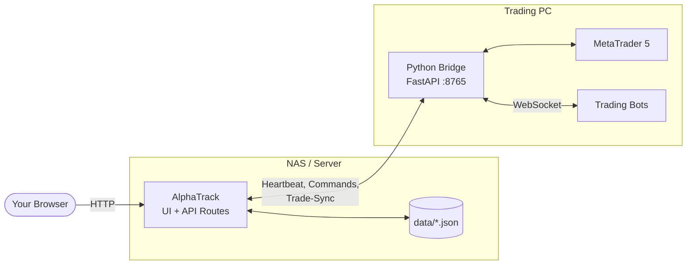

**Why a bridge?** MetaTrader 5 only runs on Windows and needs to stay permanently connected to the broker. The bridge encapsulates this connection in a standalone Python process on the trading PC. That keeps the actual AlphaTrack app platform-independent (it runs, for example, without issues in Docker on a NAS) and means it never needs direct access to MT5 or Windows itself.

This has real practical benefits: trading keeps running even if the app restarts or is briefly unreachable. MT5 credentials stay exclusively local on the trading PC. And the app and the trading setup can be updated independently of each other.

- **AlphaTrack** runs on the NAS (Docker) or locally on a PC
- **The Python bridge** runs on the bot PC alongside MT5 and sends heartbeats to AlphaTrack
- **Communication** happens exclusively on the local network - no internet required

---

## Contributing

Found a bug or have a feature idea? Check [CONTRIBUTING.md](CONTRIBUTING.md) — bug reports, feature requests, and pull requests are welcome. Note that contributions are accepted under the same [license](#license) as the project.

---

## License

[PolyForm Noncommercial License 1.0.0](https://polyformproject.org/licenses/noncommercial/1.0.0) — see [LICENSE](LICENSE). Copyright (c) 2026 G99SEMAN.

Free to use, modify, and share for any noncommercial purpose (personal use, learning, contributing back). **Commercial use — including selling AlphaTrack or a modified version of it, or offering it as a paid service — is not permitted.**

---

## Disclaimer

AlphaTrack was developed with the help of AI, among other things. Errors
are not excluded. Use at your own risk — no liability is assumed for
damages or trading losses. Intended exclusively for personal use.
